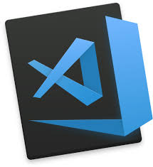

# Hi I'm Jichang Jung 👋

+ 
+ 
+ 
+ 

## 학력
----
|             Education                            |    Date   |
|:------------------------------------------------:|:---------:|
|           세민직업전문학교                        | 2021.3-   |
| North Shore international academy in New Zealand | 2011-2013 |
| Randwick TAFE NSW in Australia                   | 2010-2011 |
| Granville TAFE NSW in Australia                  | 2009-2010 |

## 언어
----
+ 한국어
+ 영어
+ 따갈로그
  
## 소개서
----
  ### 안녕하세요. 서툴고 더디지만 꾸준히 성장하는 앱개발자가 되고 싶은 정지창 입니다. 저는 North Shore international academy in New Zealand(20111 ~ 2013) 요리학과를 전공하였습니다. 제가 앱 개발에 관심을 가지게 되었던 것은 웹과 앱개발 공부를 시작한 동생을 보고 새로운 시각을 접하게 되면서부터였습니다. 가장 멋있게 생각해왔던 점은 개발에는 상한선이 없다는 것이었습니다. 보통의 업종과 다르게 일을 진행하면서 자기주장을 많이 반영할 수 있으며 본인 스스로가 제한만 두지 않는다면 무궁무진한 아이디어를 만들어 낼 수 있다는 부분과, 작은 개발 하나가 생활의 방식을 바꾸는 혁신 또한 제가 앱개발자가 되기로 결심한 이유 중에 하나였습니다. 그렇게 2020년 때부터 모바일 개발자에 관심을 가진 이후 세민직업전문학원을 알게되었고 부랴부랴 등록을하고 배움을위해 하던일은 그만두었습니다.전공이 아니었던 저에게는 쉽지 선택이었습니다. 하지만 그럼에도 쉽게 포기하지는 않았습니다. 오래전부터 진중하게 생각하고 임한 것이기에 무거운 책임감으로 더 많이 노력해서 마지막에 수료할 때는 가장 많이 남겨가자는 각오를 다졌습니다.

## 보유 기술 및 사용도구
----
### Visual Studio Code

+ 세민직업전문학원에서 배우고있으며 배운것들을 블로그에 포스팅하고있습니다.
+ (https://github.com/bradjjc) 개인적으로 공부하거나 작업한 자료들이 들어있는 Git Repository입니다.

### Flutter Android Studio

+ 세민직업전문학원에서 배우고있으며 배운것들을 블로그에 포스팅하고있습니다.

@TODO ... 작성중

## 활동
----
+ 블로그운영
  
  + (https://bradjung.tistory.com/)
  + 배우고 있는 내용을 매일 포스팅중

+ 세민직업전문학교
